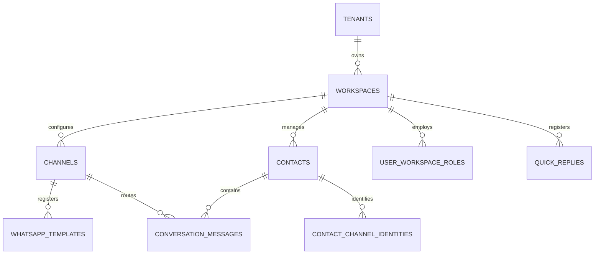
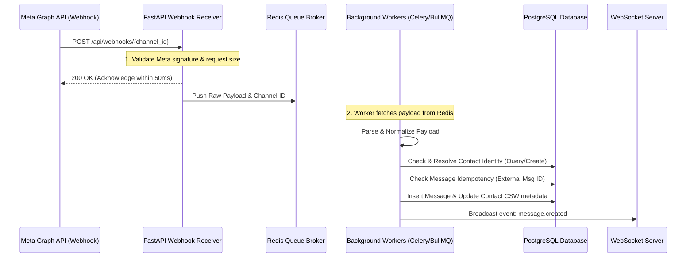
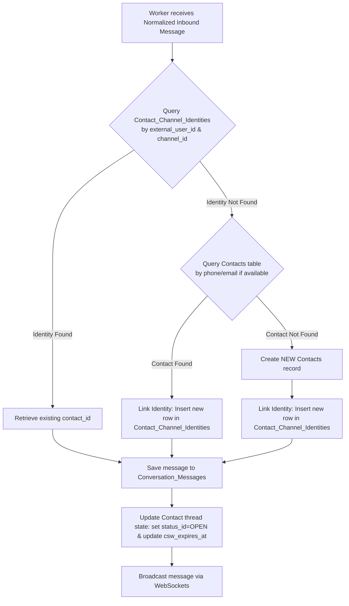

# Functional Specification: WhatsApp BSP & CRM-Integrated Omnichannel Conversation Engine

This document details the technical architecture, streamlined database schema, setup workflows, and step-by-step logic required to implement the WhatsApp BSP (Business Solution Provider) capability and Omnichannel Conversation Engine. This module functions as a cost-effective, self-hosted alternative to respond.io, allowing tenants to manage conversation lifecycles and interact across WhatsApp, Facebook Messenger, Instagram, Douyin, and Xiaohongshu directly inside the CRM.

---

## 1. Unified Tenant & Consolidated Conversation Schema

To match a CRM-centric experience and simplify the database structure, we merge the concept of **Conversations** and **Contacts**. Because **1 Contact represents exactly 1 messaging thread** across their active channels within a Workspace, a separate `Conversations` table is redundant. 

Instead, the `Contacts` table stores both the customer's CRM profile information and the active thread metadata (e.g., assignment, status, and WhatsApp session windows).

### 1.1 Streamlined Database Schema

**`Workspaces` Table:**
* `id` (UUID, Primary Key)
* `tenant_id` (UUID, Foreign Key to `Tenants`)
* `name` (String, e.g., "Dreamz Sales & Support")
* `status_id` (UUID, Foreign Key to `Statuses`)
* `created_at` (Timestamp)
* `updated_at` (Timestamp)

**`User_Workspace_Roles` Table:**
* `id` (UUID, Primary Key)
* `user_id` (UUID, Foreign Key to `Users`)
* `workspace_id` (UUID, Foreign Key to `Workspaces`)
* `role` (Enum: `ADMIN`, `MANAGER`, `AGENT`)
* `status_id` (UUID, Foreign Key to `Statuses`)
* `created_at` (Timestamp)

**`Channels` Table:**
* `id` (UUID, Primary Key)
* `workspace_id` (UUID, Foreign Key to `Workspaces`)
* `channel_type` (Enum: `WHATSAPP`, `FACEBOOK`, `INSTAGRAM`, `DOUYIN`, `XIAOHONGSHU`)
* `name` (String, e.g., "Official WhatsApp")
* `credentials_json` (Encrypted JSON containing access keys, app tokens, phone number IDs, and webhook secrets)
* `is_active` (Boolean)
* `status_id` (UUID, Foreign Key to `Statuses`)
* `created_at` (Timestamp)
* `updated_at` (Timestamp)

**`Contacts` Table (Consolidated Profile & Thread Metadata):**
* `id` (UUID, Primary Key)
* `workspace_id` (UUID, Foreign Key to `Workspaces`)
* `first_name` (String, Nullable)
* `last_name` (String, Nullable)
* `email` (String, Nullable)
* `phone` (String, Nullable) - *Primary WhatsApp / contact number*
* `avatar_url` (String, Nullable)
* `custom_fields_json` (JSON, Nullable) - *Dynamic CRM properties*
* `assigned_user_id` (UUID, Foreign Key to `Users`, Nullable) - *Current agent owning this contact/thread*
* `status_id` (UUID, Foreign Key to `Statuses` - e.g., `OPEN`, `SNOOZED`, `CLOSED`)
* `priority` (Enum: `LOW`, `MEDIUM`, `HIGH`, `URGENT`)
* `csw_expires_at` (Timestamp, Nullable) - *WhatsApp Customer Service 24h Window expiry time*
* `last_incoming_message_at` (Timestamp, Nullable)
* `last_message_at` (Timestamp, Nullable)
* `created_at` (Timestamp)
* `updated_at` (Timestamp)

**`Contact_Channel_Identities` Table:**
* `id` (UUID, Primary Key)
* `contact_id` (UUID, Foreign Key to `Contacts`)
* `channel_id` (UUID, Foreign Key to `Channels`)
* `external_user_id` (String) - *Stores Platform ID (e.g., PSID for Messenger, IGID for Instagram, phone number for WhatsApp, OpenID for Douyin/XHS)*
* `profile_name` (String, Nullable) - *User handle or raw nickname returned by webhook*
* `created_at` (Timestamp)

**`Conversation_Messages` Table:**
* `id` (UUID, Primary Key)
* `contact_id` (UUID, Foreign Key to `Contacts`) - *Direct relationship to unified Contact*
* `channel_id` (UUID, Foreign Key to `Channels`) - *Identifies which platform the message is sent/received on*
* `sender_type` (Enum: `AGENT`, `CONTACT`, `SYSTEM`)
* `sender_id` (UUID, Nullable) - *FK to `Users` if AGENT, FK to `Contacts` if CONTACT, Null if SYSTEM*
* `message_type` (Enum: `TEXT`, `IMAGE`, `AUDIO`, `VIDEO`, `DOCUMENT`, `TEMPLATE`, `INTERACTIVE`)
* `body` (Text, Nullable)
* `media_url` (String, Nullable) - *S3/Cloud storage URL for uploads*
* `external_message_id` (String) - *Unique ID from Meta/ByteDance (vital for matching delivery receipts)*
* `delivery_status` (Enum: `SENT`, `DELIVERED`, `READ`, `FAILED`)
* `error_code` (String, Nullable)
* `error_message` (Text, Nullable)
* `metadata_json` (JSON, Nullable) - *Stores clicked buttons, template names, etc.*
* `created_at` (Timestamp)

---

## 2. Non-Technical Channel Setup & Onboarding Experience

To ensure a smooth setup for non-technical event admins and tenants, the platform implements a step-by-step visual configuration wizard. 

### 2.1 Meta (WhatsApp/Messenger) Onboarding Flows

The setup wizard in the workspace settings offers two connection pathways:

#### A. Meta Embedded Signup (Recommended BSP Mode - One-Click Setup)
This flow handles the heavy lifting through Meta's OAuth popup:
1. **The Trigger:** Admin clicks **"Connect Facebook & WhatsApp"** inside Workspace Settings.
2. **Meta Popup:** The Metronic app opens Meta’s official Embedded Signup SDK popup.
3. **Login & Approve:** The admin logs into their Facebook Account, selects their **Meta Business Portfolio (Manager)**, chooses or creates a **WhatsApp Business Account (WABA)**, and selects the phone number they wish to register.
4. **Permissions Granted:** Meta prompts the admin to approve permissions for our app (Manage WhatsApp, Manage Messenger, Send Messages).
5. **Token Exchange:** On completion, the popup passes an authorization code back to our FastAPI endpoint `/api/channels/oauth-callback`. 
6. **Automated Provisioning:**
   * The backend exchanges this code for a **Permanent System User Access Token** via Meta's Graph API.
   * The backend automatically queries Meta's API to fetch the registered WABA details, Phone Number ID, and verified numbers.
   * It registers these details in a new `Channels` record (`credentials_json`), auto-configures the Webhook subscriptions with Meta, and displays a green **"Connected Successfully"** screen.

#### B. Manual Setup (Developer Mode)
For tenants running their own Meta Developer Apps, the wizard provides clean, copy-paste fields with helpful inline descriptions and validation checks:
* **App ID & App Secret**
* **System User Access Token** (Permanent)
* **WhatsApp Business Account ID (WABA ID)**
* **Phone Number ID**

### 2.2 Quick Verification & Webhook Setup Help
Once credentials are saved, the system displays their specific **Webhook Endpoint URL** and a **Verification Token** to copy-paste into the Meta Developer Console (if in manual mode). A **"Test Connection"** button executes a lightweight ping to `https://graph.facebook.com/v19.0/{phone_number_id}` and updates the status badge to "Active" once verified.

---

## 3. Zero-Loss Webhook Processing Pipeline

Webhooks are susceptible to network drops, high-traffic spikes, or database downtime. To guarantee **zero message loss**, the backend implements a highly scalable, decoupled web-queue-worker pattern.

### 3.1 Step-by-Step Reliable Execution Flow

1. **Fast Webhook Acknowledgment:**
   * When Meta's webhook hits `POST /api/webhooks/{channel_id}`, the FastAPI server performs basic payload structure validation and signature verification.
   * Within **50 milliseconds**, it returns a `200 OK` response to Meta. This prevents Meta from marking our webhook as unhealthy and retrying, which causes duplicates and server load.
   * Behind the scenes, the endpoint pushes the raw payload to a **Redis-backed Queue** (via Celery or BullMQ).

2. **Idempotency Safeguard:**
   * The background worker fetches the task and retrieves `external_message_id` from the normalized payload.
   * It queries `Conversation_Messages` where `external_message_id = X` to check for duplicates. If it exists, the worker safely skips processing (preventing duplicate message bubbles in the UI).

3. **Database & API Resilience (Retries):**
   * If the PostgreSQL database is locked or down, the background worker automatically schedules a retry with **exponential backoff** (e.g., retry in 5s, 30s, 2m, 10m).
   * Because the message is persisted in Redis, it is completely secure until the database is back online.

---

## 4. Contact Resolution & Identity Matching Logic

When a new message is dequeued from the Redis queue, the background worker resolves the contact and updates thread status using the following precise steps:

### 4.1 Step-by-Step Logic
1. **Identify Sender Handle:** Retrieve `external_user_id` (e.g., the customer's phone number for WhatsApp or PSID for Facebook) and `channel_id` from the payload.
2. **Exact Handle Match:** Query the `Contact_Channel_Identities` table.
   * *If Match is Found:* We have a verified contact. Set `contact_id` to the associated contact's ID.
3. **Cross-Platform Stitching (Secondary Match):**
   * *If Match is NOT Found:* Search the `Contacts` table directly. If the platform is WhatsApp, query `Contacts` where `phone = external_user_id` in the current workspace.
   * *If Phone Matches:* The customer is already registered in the CRM (e.g., from an event ticket purchase or lead form). Link their new channel handle by inserting a record into `Contact_Channel_Identities` pointing to this `contact_id`.
   * *If Phone DOES NOT Match:* Create a brand-new profile in `Contacts` (using their raw profile name/avatar from webhook), then insert a record in `Contact_Channel_Identities` to bind them.
4. **Insert Message:** Write a row in `Conversation_Messages` with `contact_id`, `channel_id`, `sender_type = 'CONTACT'`, and delivery status set to `READ` (since we received it).
5. **Re-open Thread & Calculate CSW:**
   * Update the contact record's thread variables:
     * `status_id` is updated to `OPEN` (auto-opening the thread in the CRM drawer).
     * `last_incoming_message_at` and `last_message_at` set to `current_time`.
     * `csw_expires_at` is updated to `current_time + 24 hours` (allowing free-form session messages).
6. **Push Live Update:** Broadcast the new message event via WebSockets to connected browsers.

---

## 5. CRM-Integrated Side-Drawer Chatbox UI

Rather than forcing users to navigate away from the CRM to a dedicated multi-pane inbox, the chat interface is integrated natively within the workspace's forms (e.g., inside the Lead Details or Contact Profile screens), maximizing screen real estate and agent efficiency.

### 5.1 The Three-Zone Screen Layout
1. **System Sidebar (Left):** The standard Dreamz Metronic navigation panel (Dashboards, Contacts, Events, Invoices, Settings).
2. **Main CRM Form View (Center):** Displays comprehensive lead or contact details:
   * Header details (e.g., `Lead: LD-2026-0023`, status badges).
   * Client parameters (Client Name, Contacts subtable, Property Details, Event Tickets purchased).
   * Tabbed sections (Quotation revisions, Sales Orders, Action logs).
3. **CRM Side-Drawer Chatbox (Right):** A docked, slide-out chatbox specifically for messaging and collaboration:
   * **Chat Header:** Active channel icon, Contact profile name, assign/reassign dropdown, and dynamic toggle tabs between **Activities** (internal audit trails) and **Messages** (external conversations).
   * **Thread Window:** Real-time chat bubbles.
     * *Customer messages:* Dark green bubbles (aligned left).
     * *Agent replies:* Light grey bubbles (aligned right).
     * *System notes:* Light yellow bubbles (centered, strictly internal and never transmitted externally).
   * **Chat Input Area:**
     * Textbox supporting rich text and paste-to-upload attachments.
     * **Dynamic Star Button:** Triggers Quick Replies or templates.
     * **CSW Lock Indicator:** If `csw_expires_at` has passed, the input area locks and a warning banner appears: *"24-hour Customer Service Window is closed. Select a WhatsApp template to message this user."* Clicking the select box displays approved templates from `Whatsapp_Templates`.

---

## 6. Integration with Core Engines

This feature hooks directly into Dreamz EMS's Sprint 1 platform engines:

1. **Workflow Engine (Automation Triggering):**
   * **Triggers:** `onNewMessageReceived` (fires when a contact messages any channel) and `onCSWExpired`.
   * **Actions:** `SendAutoReply` (using a templates merge block) and `AssignContact` (routes the contact to an available agent's queue).
   * *Example:* If a customer messages after business hours, the Workflow Engine automatically executes the `SendChannelMessage` action with the tenant's pre-configured off-hours template.

2. **Rule Engine (Smart Routing):**
   * Evaluates the contact's message content.
   * If a message body contains words like "pricing" or "payment", it runs rules to update `Contacts.assigned_user_id` to the Finance or Sales agent pool, and escalates priority to `HIGH`.

3. **Status & State Machine Engine (Thread Lifecycle):**
   * Manages transitions between `OPEN`, `SNOOZED`, and `CLOSED`.
   * Setting a thread status to `CLOSED` triggers the Workflow Engine to execute a satisfaction survey template, dispatching it automatically via their active chat channel.
